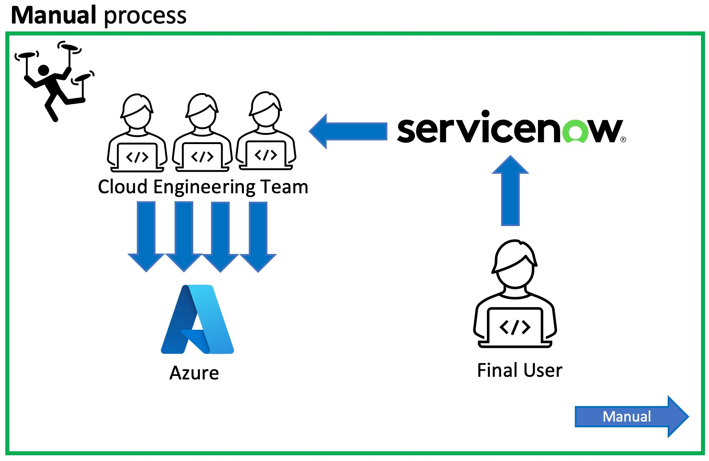
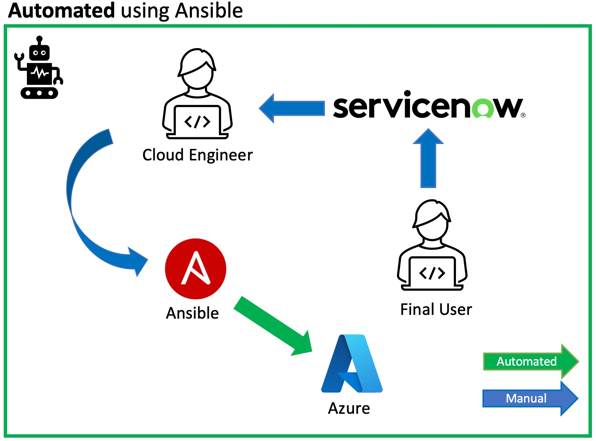
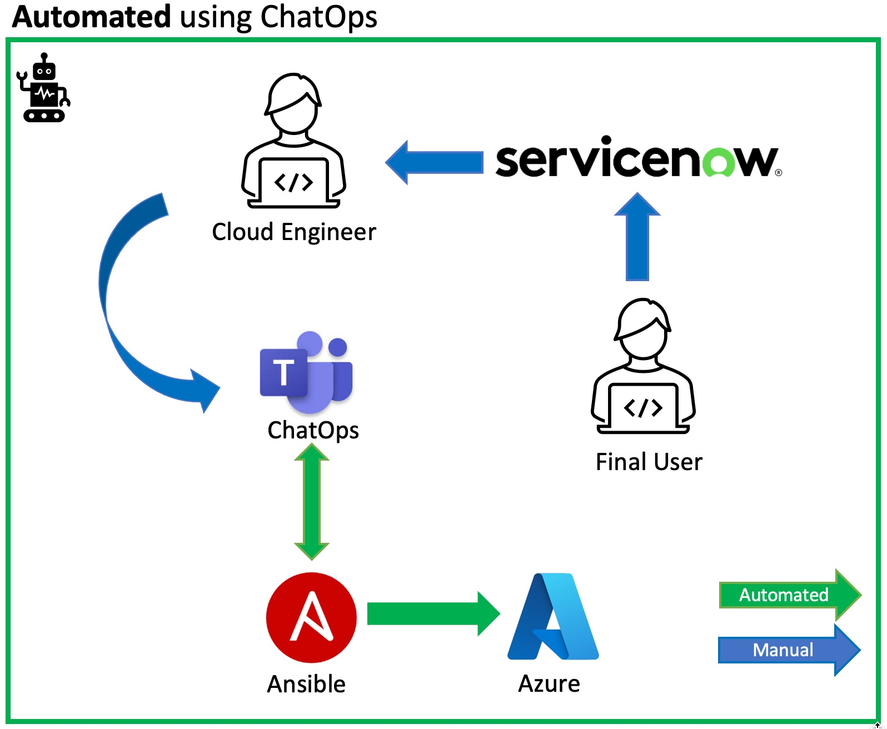
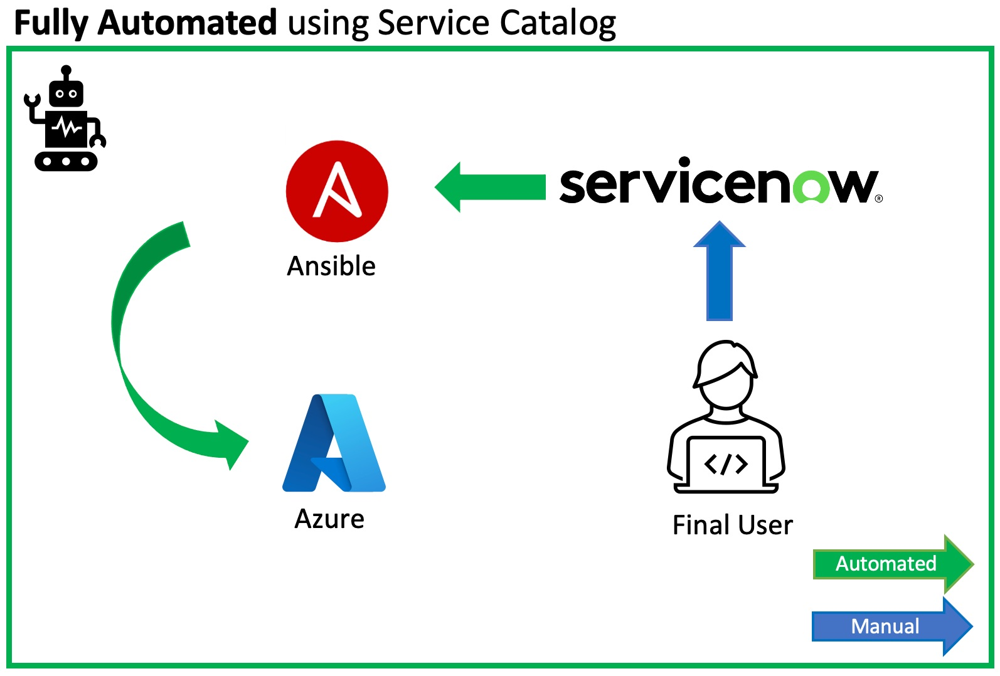
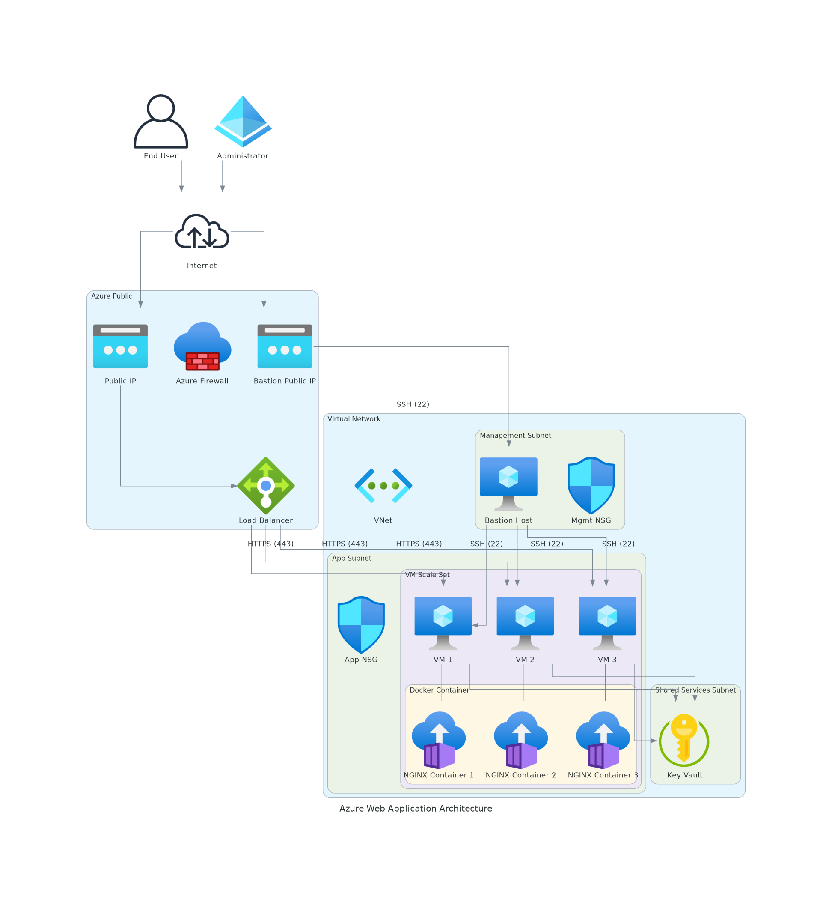
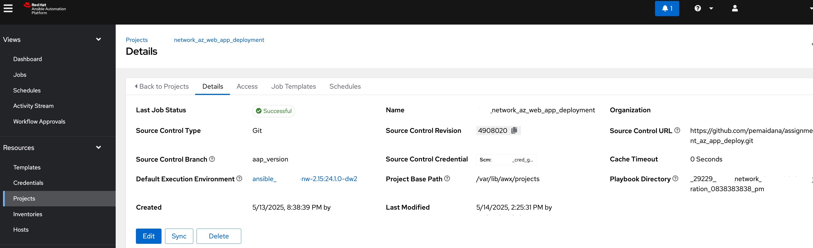

# High Available Azure Web App Deployment with Ansible
[](https://github.com/nleiva/ansible-web-server/actions/workflows/ansible-lint.yml)

### This repo contains an Ansible role that automates the deployment of a Web Application on Azure Cloud.
<br/><br/>

## Problem Statement

1. Cloud Engineers spend hours implementing several requests to deploy Azure Cloud infrastructure.

2. Requests often take days to be completed due to Cloud Team is busy troubleshooting issues and implementing projects.

3. Deployment tasks are repetitive and error-prone due to manual steps required.
<br/><br/>
   
<p align="center">

</p>

<br/><br/>

## Benefits of this Automation Solution

1. Reduce (or even avoid) efforts required from Cloud Engineering team to deploy Azure Cloud infrastructure.

2. Standardize an automated procedure, avoid error-prone implementations.

3. Provide building-block for Service Catalog consumption model (Ansible integration with ServiceNow required).


<br/><br/>
## Suggested approaches to adopt this Automation

### 1. Ansible as a tool for the Cloud Engineering team:
<br/><br/>

<p align="center">

</p>


<br/><br/>
### 2. Use ChatOps for simplifying the usage of Automation
<br/><br/>
 
<p align="center">

</p>


<br/><br/>
### 3. Fully Automated using ServiceNow Service Catalog (recommended):

Free-up Cloud Team resources.

Improves the User Experience.

Leverages API integration between Ansible and ServiceNow.
<br/><br/>
 
<p align="center">

</p>

<br/><br/>

### This asset is focused on the Option 1, Ansible automation only.

<br/><br/>

## Solution Overview

### This Ansible role creates all Azure components and services needed to deploy a High Available Web Application.
<br/><br/>
Below is the architecture diagram generated with: https://github.com/mingrammer/diagrams
<br/><br/>

<p align="center">

</p>
<br/><br/>

### VMs High Availability: Azure Load Balancer and Availability Set

Azure VMs are placed into a Availability-Set to provide High Availability.

Azure Standard Load Balancer is also placed in front of Azure VMs.

<br/><br/>
### Network Security: Subnets, Network Security Groups, Network Rules.

Azure VMs are placed in a specific BackEnd Subnet that is protected by a Network Security Group.

Azure VMs don't have Public IPs to avoid unwanted external access.

Azure Standard Load Balancer is located on the Frontend Subnet as it has specific rules to allow Web App client access.

Azure Load Balancer has a Public IP to receive connection from clients on the Internet.

<br/><br/>
### VM Secure Access: Azure Bastion Service.

Azure VMs only SSH accessible thru Azure Bastion that is part of this solution.

This provide high level security to unwanted management access to Azure VMs.

<br/><br/>
### Application Security: SSL Encryption, Load Balancing Rules.

Azure VMs are deployed with SSL configuration and internal firewall-rule to allow incoming connection to Web App on TCP-443 port.

Azure Load Balance rule are applied to allow only TCP-443 traffic from External sources to App VMs.

<br/><br/>
### Application: NGINX and Docker.

Azure VMs are deployed with pre-configuration including NGINX, Docker engine and NGINXdemos-hello docker image..


<br/><br/>
### Solution components and properties:


```yaml
resource-group:
  1: project-rg
vnet:
  1: project-vnet
subnet:
  1: project-backend-subnet
  2: project-frontend-subnet
  3: AzureBastionSubnet
nsg:
  1: backend-nsg
  2: frontend-nsg
AzureLoadBalance:
  1: project-lb
  backend-pool:
    1: node-1
    2: node-2 
  probe: 
    1: 443/TCP
  load-balance-rule:
    1: 443/TCP
bastion:
  1: project-bastion
availability-set:
  vms:
    1: project-vm-01
      image:
        1: ubuntu 24.04 LTS
      nic:
        1: nic-vm-01
      disk:
        1: disk-vm-01
    2: project-vm-02
      image: 
        1: ubuntu 24.04 LTS
      nic:
        1: nic-vm-02
      disk:
        1: disk-vm-02
```

<br/><br/>

# How to consume this Ansible Automation?
## Pre-Reqs:

- Azure subscription.
- Ansible implementation is required.
- [Configure Ansible integration with Azure Cloud](azure_reqs.md)


## Creating a Project and Job Template to Run the playbook:

Follow these steps to provision the Web Server(s).

1. Create a Project for this repo (`https://github.com/pemaidana/assignment_az_app_deploy`). I called the Project `network_az_web_app_deployment` in the example below.

<p align="center">

</p>


2. Create a Job Template pointing to [az_webapp_deploy.yml](az_webapp_deploy.yml).

<p align="center">

</p>

5. Run the Job Template.

<p align="center">

</p>

It should look like this when it finishes:

<p align="center">

</p>

## Accessing the Web Server

We distribute the traffic among the instances using an [Azure Load Balancer](https://docs.microsoft.com/en-us/azure/load-balancer/load-balancer-overview) to prevent failure in case any of the virtual machines fail. By default the web server is at `http://testbed.eastus.cloudapp.azure.com/`. You can modify this with the variable `prefix`. Its default value is `testbed`.

This URL will take you to one of the backend VM's. For example:

### VM 1

<p align="center">

</p>

### VM 2

<p align="center">

</p>

## Deleting the resources

You can create a similar Job Template pointing to [main.yml](main.yml) and pass an extra-var `delete=true`.

<p align="center">

</p>

And run it.

<p align="center">

</p>

## Run from an Execution Environment

You can alternatively run this with [ansible-navigator](https://github.com/ansible/ansible-navigator#installing).

```bash
pip3 install 'ansible-navigator[ansible-core]'
```

### EE Create Web Server

```bash
ansible-navigator run main.yml
```

<p align="center">

</p>

#### EE Create Web Server in another cloud provider with a custom domain

```bash
ansible-navigator run main.yml -e cloud=aws -e dns_zone=sandbox760.opentlc.com
```

### EE Delete Web Server

```bash
ansible-navigator run main.yml -e delete=true
```

<p align="center">

</p>

**Note**: I use [podman](https://podman.io/) as my container engine (`container-engine`). You can change to another alternative in the ansible [navigator config file](ansible-navigator.yml).

## Run from the Ansible Core CLI

Check [ansible_core](ansible_core.md).


---
title: Quickstart - Create an Azure service principal for Ansible
description: In this quickstart, learn how to create an Azure Service Principal to authenticate to Azure.
keywords: ansible, azure, devops, bash, cloudshell, playbook, azure cli, azure powershell, powershell
ms.topic: quickstart
ms.date: 03/30/2022
ms.custom: devx-track-ansible, devx-track-azurecli, devx-track-azurepowershell, mode-portal
---

# Quickstart: Create an Azure service principal for Ansible

In this quickstart, you create an Azure service principal with AzureCLI or Azure PowerShell and authenticate to Azure from Ansible.

In this article, you learn how to:

> [!div class="checklist"]
>
> * Create an Azure service principal using the Azure CLI
> * Create an Azure service principal using the Azure PowerShell
> * Assign a role to the Azure service principal
> * Get key information from the service principal
> * Set environment variables so that Ansible can retrieve the service principal values
> * Test the service principal

## Prerequisites

[!INCLUDE [open-source-devops-prereqs-azure-subscription.md](../includes/open-source-devops-prereqs-azure-subscription.md)]

[!INCLUDE [ansible-prereqs-cloudshell-use-or-vm-creation1.md](includes/ansible-prereqs-cloudshell-use-or-vm-creation1.md)]

## Create an Azure service principal

An Azure service principal gives you a dedicated account to manage Azure resources with Ansible.

Run the following code to create an Azure service principal:

# [Azure CLI](#tab/azure-cli)
```azurecli-interactive
az ad sp create-for-rbac --name ansible \
            --role Contributor \
            --scopes /subscriptions/<subscription_id>
```

>[!NOTE]
>Store the password from the output in a secure location.

# [Azure PowerShell](#tab/azurepowershell)

```azurepowershell
$password = '<Password>'

$credentials = New-Object Microsoft.Azure.Commands.ActiveDirectory.PSADPasswordCredential `
-Property @{ StartDate=Get-Date; EndDate=Get-Date -Year 2024; Password=$password}

$spSplat = @{
    DisplayName = 'ansible'
    PasswordCredential = $credentials
}

$sp = New-AzAdServicePrincipal @spSplat
```

Replace `'<Password>'` with your password.

>[!NOTE]
>Store the password in a secure location.

---

## Assign a role to the Azure service principal

By default service principals don't have the access necessary to manage resources in Azure.

Run the following command to assign the **Contributor** role to the service principal:

# [Azure CLI](#tab/azure-cli)
```azurecli-interactive
az role assignment create --assignee <appID> \
    --role Contributor \
    --scope /subscriptions/<subscription_id>
```

Replace `<appID>` with the value provided from the output of `az ad sp create-for-rbac` command.

>[!NOTE]
>To improve security, change the scope of the role assignment to a resource group instead of a subscription.

# [Azure PowerShell](#tab/azurepowershell)

```azurepowershell
$subId = (Get-AzContext).Subscription.Id

$roleAssignmentSplat = @{
    ObjectId = $sp.id;
    RoleDefinitionName = 'Contributor';
    Scope = "/subscriptions/$subId"
}

New-AzRoleAssignment @roleAssignmentSplat
```

>[!NOTE]
>To improve security, change the scope of the role assignment to a resource group instead of a subscription.

---

## Get Azure service principal information

To authenticate to Azure with a service principal, you need the following information:

* SubscriptionID
* Service Principal ApplicationId
* Service Principal password
* TenantID

Run the following commands to get the service principal information:

# [Azure CLI](#tab/azure-cli)
```azurecli-interactive
az account show --query '{tenantId:tenantId,subscriptionid:id}';

az ad sp list --display-name ansible --query '{clientId:[0].appId}'
```
# [Azure PowerShell](#tab/azurepowershell)

```azurepowershell
@{
    subscriptionId = (Get-AzContext).Subscription.Id
    clientid = (Get-AzADServicePrincipal -DisplayName 'ansible').ApplicationId.Guid
    tenantid = (Get-AzContext).Tenant.Id
}
```

---

## Authenticate to Azure with the service principal

Run the following commands to populate the required environment variables on the Ansible server:

```bash
export AZURE_SUBSCRIPTION_ID=<SubscriptionID>
export AZURE_CLIENT_ID=<ApplicationId>
export AZURE_SECRET=<Password>
export AZURE_TENANT=<TenantID>
```

Replace `<SubscriptionID>`, `<ApplicationId>`, `<Password>`, and `<TenantID>` with the values of your service principal account.

## Test service principal permissions

Run the following command to create a new Azure resource group:

```bash
ansible localhost -m azure_rm_resourcegroup -a "name=<resource_group_name> location=<resource_group_location>"
```

Replace `<resource_group_name>` and `<resource_group_location>` with your new resource group values.

```Output
[WARNING]: No inventory was parsed, only implicit localhost is available
localhost | CHANGED => {
    "changed": true,
    "contains_resources": false,
    "state": {
        "id": "/subscriptions/<subscriptionID>/resourceGroups/azcli-test",
        "location": "eastus",
        "name": "azcli-test",
        "provisioning_state": "Succeeded",
        "tags": null
    }
}
```

Run the following command to delete the Azure resource group:

```bash
ansible localhost -m azure_rm_resourcegroup -a "name=<resource_group_name> state=absent force_delete_nonempty=yes"
```

Replace `<resource_group_name>` with the name of your resource group.

```Output
[WARNING]: No inventory was parsed, only implicit localhost is available
localhost | CHANGED => {
    "changed": true,
    "contains_resources": false,
    "state": {
        "id": "/subscriptions/subscriptionID>/resourceGroups/azcli-test",
        "location": "eastus",
        "name": "azcli-test",
        "provisioning_state": "Succeeded",
        "status": "Deleted",
        "tags": null
    }
}

```

# Azur Cloud Network Infrastructure and Stateless Application Deployment automated with Ansible

How to Use This Solution
1.	Clone the Repository: Clone the GitHub repository once set up.
2.	Configure Parameters: Update the vars/main.yml file with your specific settings (SSH keys, IP addresses, etc.).
3.	Run the Playbook: Execute the Ansible playbook to deploy the entire infrastructure.
4.	Access the Application: Access the application via HTTPS through the load balancer's public IP or DNS name.

## Next steps

* [Configure Linux virtual machines in Azure using Ansible](./vm-configure.md)
