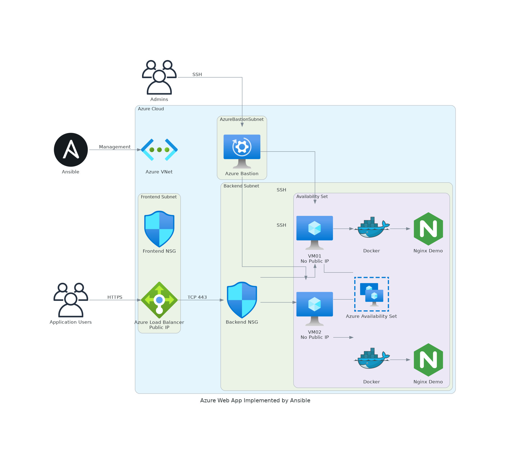
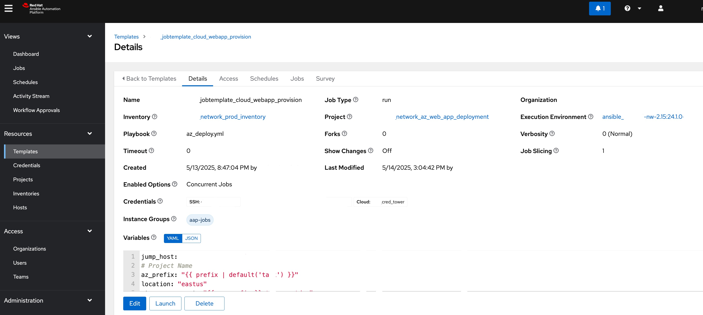

# High Available Azure Web App Deployment with Ansible
[](https://github.com/nleiva/ansible-web-server/actions/workflows/ansible-lint.yml)

### This repo contains an Ansible role that automates the deployment of a Web Application on Azure Cloud.
<br/><br/>

## Problem Statement

1. Cloud Engineers spend hours implementing several requests to deploy Azure Cloud infrastructure.

2. Requests often take days to be completed due to Cloud Team is busy troubleshooting issues and implementing projects.

3. Deployment tasks are repetitive and error-prone due to manual steps required.
<br/><br/>
   
<p align="center">

</p>

<br/><br/>

## Benefits of this Automation Solution

1. Reduce (or even avoid) efforts required from Cloud Engineering team to deploy Azure Cloud infrastructure.

2. Standardize an automated procedure, avoid error-prone implementations.

3. Provide building-block for Service Catalog consumption model (Ansible integration with ServiceNow required).


<br/><br/>
## Suggested approaches to adopt this Automation

### 1. Ansible as a tool for the Cloud Engineering team:
<br/><br/>

<p align="center">

</p>


<br/><br/>
### 2. Use ChatOps for simplifying the usage of Automation
<br/><br/>
 
<p align="center">

</p>


<br/><br/>
### 3. Fully Automated using ServiceNow Service Catalog (recommended):

Free-up Cloud Team resources.

Improves the User Experience.

Leverages API integration between Ansible and ServiceNow.
<br/><br/>
 
<p align="center">

</p>

<br/><br/>

### This asset is focused on the Option 1, Ansible automation only.

<br/><br/>

## Solution Overview

### This Ansible role creates all Azure components and services needed to deploy a High Available Web Application.
<br/><br/>
Below is the architecture diagram generated with: https://github.com/mingrammer/diagrams
<br/><br/>

<p align="center">

</p>
<br/><br/>

### VMs High Availability: Azure Load Balancer and Availability Set

Azure VMs are placed into a Availability-Set to provide High Availability.

Azure Standard Load Balancer is also placed in front of Azure VMs.

<br/><br/>
### Network Security: Subnets, Network Security Groups, Network Rules.

Azure VMs are placed in a specific BackEnd Subnet that is protected by a Network Security Group.

Azure VMs don't have Public IPs to avoid unwanted external access.

Azure Standard Load Balancer is located on the Frontend Subnet as it has specific rules to allow Web App client access.

Azure Load Balancer has a Public IP to receive connection from clients on the Internet.

<br/><br/>
### VM Secure Access: Azure Bastion Service.

Azure VMs only SSH accessible thru Azure Bastion that is part of this solution.

This provide high level security to unwanted management access to Azure VMs.

<br/><br/>
### Application Security: SSL Encryption, Load Balancing Rules.

Azure VMs are deployed with SSL configuration and internal firewall-rule to allow incoming connection to Web App on TCP-443 port.

Azure Load Balance rule are applied to allow only TCP-443 traffic from External sources to App VMs.

<br/><br/>
### Application: NGINX and Docker.

Azure VMs are deployed with pre-configuration including NGINX, Docker engine and NGINXdemos-hello docker image..


<br/><br/>
### Solution components and properties:


```yaml
resource-group:
  1: project-rg
vnet:
  1: project-vnet
subnet:
  1: project-backend-subnet
  2: project-frontend-subnet
  3: AzureBastionSubnet
nsg:
  1: backend-nsg
  2: frontend-nsg
AzureLoadBalance:
  1: project-lb
  backend-pool:
    1: node-1
    2: node-2 
  probe: 
    1: 443/TCP
  load-balance-rule:
    1: 443/TCP
bastion:
  1: project-bastion
availability-set:
  vms:
    1: project-vm-01
      image:
        1: ubuntu 24.04 LTS
      nic:
        1: nic-vm-01
      disk:
        1: disk-vm-01
    2: project-vm-02
      image: 
        1: ubuntu 24.04 LTS
      nic:
        1: nic-vm-02
      disk:
        1: disk-vm-02
```

<br/><br/>

# How to consume this Ansible Automation?
## Pre-Reqs:

- Azure subscription.
- Ansible implementation is required.
- [Configure Azure Service Principal and install needed packages](azure_reqs.md)


## Creating a Project and Job Template to Run the playbook:

Follow these steps to provision the Web Server(s).

1. Create a Project for this repo (`https://github.com/pemaidana/assignment_az_app_deploy`). I called the Project `network_az_web_app_deployment` in the example below.

<p align="center">

</p>


2. Create a Job Template pointing to [az_webapp_deploy.yml](az_webapp_deploy.yml).

<p align="center">

</p>

5. Run the Job Template.

<p align="center">

</p>

It should look like this when it finishes:

<p align="center">

</p>


How to Use This Solution
1.	Clone the Repository: Clone the GitHub repository once set up.
2.	Configure Parameters: Update the vars/main.yml file with your specific settings (SSH keys, IP addresses, etc.).
3.	Run the Playbook: Execute the Ansible playbook to deploy the entire infrastructure.
4.	Access the Application: Access the application via HTTPS through the load balancer's public IP or DNS name.

## Next steps

* [Configure Linux virtual machines in Azure using Ansible](./vm-configure.md)
